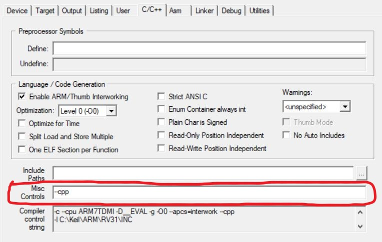

# PPO - podstawy programowania obiektowego

Te repozytorium zawiera moje propozycje rozwiązania zadanej w instrukcji refaktoryzacji kodu
na chwilę obecną te rozwiązania **nie zostały** skonsultowane z prowadzącym więc mogą być błędne

## Uruchamianie C++ w keilu
Prawdopodobnie próbując napisać klasę Led w keilu natknąłeś się na problem że keil nie rozpoznał słowa "class" - trzeba mu powiedzieć że chcemy korzystać z C++

- po uruchomieniu keila i otwarciu projektu należy wybrać "różdżkę"

- następnie wybrać zakładkę C/C++
- w polu "Misc Controls" wpisać `--cpp`

- wcisnąć OK i gotowe - keil powinien być w stanie teraz pracować z C++

## *Ostrzeżenie: przy kopiowaniu folderu po ponownym otwarciu projektu lepiej zamknąć wszystkie pliki .h w keilu i otworzyć na nowo, dzięki temu unikniemy sytuacji, że zmodyfikujemy plik tam gdzie nie chcemy*